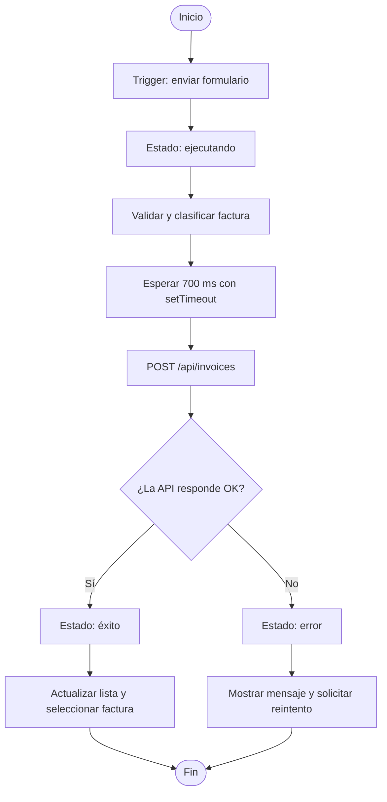

# Workflow de automatización

El flujo se activa cuando el usuario envía el formulario de una factura. Después de una espera breve que representa el procesamiento automático, la aplicación registra la factura mediante `fetch`. La respuesta de la API determina el camino de éxito o error.

La limpieza del efecto cancela el temporizador con `clearTimeout` si el componente se desmonta o cambia la factura pendiente antes de completar el proceso.